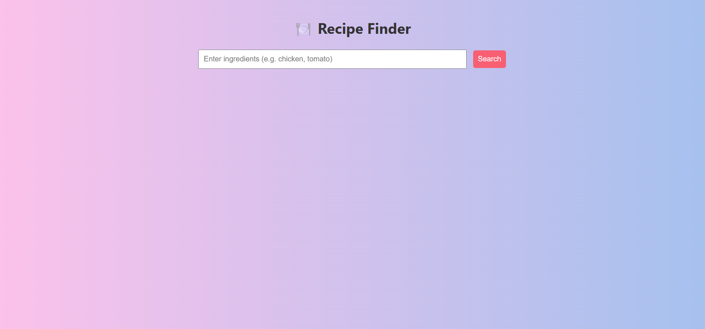
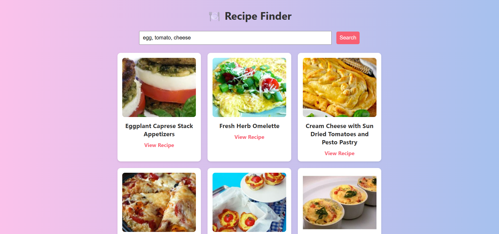

# 🍽️ Recipe Finder App

A colorful and responsive web app built using Python Flask and HTML/CSS/JS that lets users search for real recipes based on ingredients they enter. Results are fetched live from the Spoonacular API.

## 🌟 Features

- Ingredient-based recipe search
- Real-time results from Spoonacular
- Responsive design with cards for each recipe
- External links to full cooking instructions
- Colorful, modern user interface

## 🖼 Screenshot / Banner

## 🧪 Technologies Used

- Python 3
- Flask (Backend)
- HTML5, CSS3, JavaScript (Frontend)
- Spoonacular API
- Requests Library

## 🚀 How to Run

1. Clone or download this repository
2. Install dependencies:
   
   pip install flask requests

3. Add your Spoonacular API key in app.py:

   SPOONACULAR_API_KEY = 'your_api_key_here'

4. Run the Flask server:

   python app.py

5. Open your browser and go to:

   http://localhost:5000

📁 Project Structure

project/
├── app.py             → Flask backend script
├── index.html         → Main frontend UI
├── style.css          → App styling
├── README.md          → This documentation file
├── Screenshot1.png    → Reciepe Banner
├── Screenshot2.png    → Input and receipe options
├── Screenshot3.png    → Receipe

📎 API Source

   Spoonacular Food API
